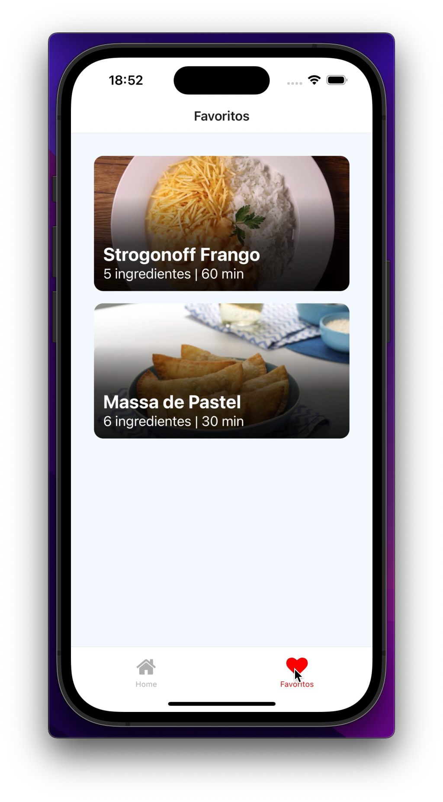

<h1 align="center">
    
    
    
    
</h1>

# Indice

- [Sobre](#-sobre)
- [Tecnologias Utilizadas](#-tecnologias-utilizadas)
- [Como baixar o projeto](#-como-baixar-o-projeto)

## 🔖&nbsp; Sobre

O projeto **ReceitaFacil** é um App que foi criado dentro do curso **React Native Insider** com o intuito de colocarmos em prática todo conteúdo estudado durante o curso.

---

## 🚀 Tecnologias utilizadas

O projeto foi desenvolvido utilizando as seguintes tecnologias

- [ReactNative](https://reactnative.dev/)
- [JSON Server](https://github.com/typicode/json-server)
- [Axios](https://github.com/axios/axios)

---

## 🗂 Como baixar o projeto

```bash

    # Clonar o repositório
    $ git clone https://github.com/RafaMPinheiro/ReceitaFacil.git

    # Entrar no diretório
    $ cd ReceitaFacil

    # Instalar as dependências
    $ npm install

    # Iniciar o banco de dados
    $ json-server –watch -d 180 –host SEU-IP db.json

    # Iniciar o projeto
    $ npx expo start
```

---

Desenvolvido 💜 por Rafael Messias Pinheiro
